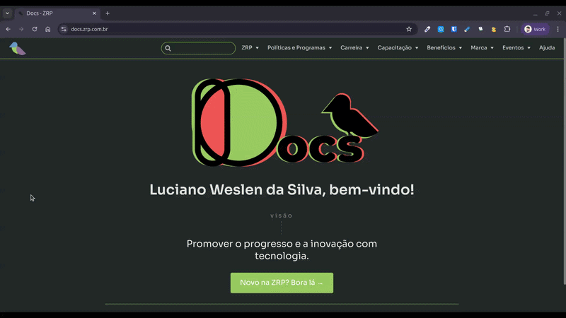

<h1>
  Apadrinhamento
</h1>

<h3>
  Por que você 🫵 deveria ser padrinho ou madrinha?
</h3>

---
layout: center
bg-color: primary
---

# O que é apadrinhamento?

---
layout: content
---

# Manual do apadrinhamento

---
layout: center
bg-color: secondary
---

# Quem já foi padrinho/madrinha?

---
layout: center
bg-color: primary
---

# Como você guiou a conversa?

---
layout: content
---

# Bora apadrinhar?

---
layout: center
bg-color: primary
---

# Dúvidas ou Sugestões?

---
layout: center
routeAlias: links
---

[Slides](gentle-platypus-c62685.netlify.app) · [GitHub](https://github.com/luweslen/palestras/2026-03-27)

<PoweredBySlidev mt-2 />

---
layout: end
email: luciano.weslen@zrp.com.br
website: zrp.com.br
---

# Muito obrigado!

Se ficou com dúvidas a respeito de uma ou mais partes deste documento, não hesite em entrar em contato conosco.
